# Adarsh R. Kumar

Hi, I’m [@adarshrkumar](https://github.com/adarshrkumar)

## Interests

- Computer Science
- Coding
- Photography
- Music

## Tools

### Design Softwares

| Tool | Proficiency Level |
| --- | --- |
|  | &nbsp; 80% |
|  | &nbsp; 100% |
|  | &nbsp; 100% |
|  | &nbsp; 100% |

### Other Tools

| Tool | Proficiency Level |
| --- | --- |
|  | &nbsp; 50% |
|  | &nbsp; 50% |
|  | &nbsp; 25% |
|  | &nbsp; 75% |
|  | &nbsp; 95% |
|  | &nbsp; 45% |
|  | &nbsp; 45% |
|  | &nbsp; 100% |
|  | &nbsp; 99% |
|  | &nbsp; 80% |
|  | &nbsp; 60% |
|  | &nbsp; 75% |
|  | &nbsp; 75% |

## Languages

### Web Development

#### Front-End

| Lang | Proficiency Level |
| --- | --- |
|  | &nbsp; 99% |
|  | &nbsp; 95% |
|  | &nbsp; 90% |
|  | &nbsp; 80% |
|  | &nbsp; 75% |
|  | &nbsp; 80% |

#### Back End

| Lang | Proficiency Level |
| --- | --- |
|  | &nbsp; 75% |
|  | &nbsp; 90% |
|  | &nbsp; 90% |
|  | &nbsp; 90% |
|  | &nbsp; 70% |
|  | &nbsp; 40% |
|  | &nbsp; 40% |
|  | &nbsp; 90% |
|  | &nbsp; 50% |

### Other Languages

| Lang | Proficiency Level |
| --- | --- |
| ) | &nbsp; 60% |
|  | &nbsp; 40% |
|  | &nbsp; 30% |
|  | &nbsp; 70% |
|  | &nbsp; 65% |
|  | &nbsp; 50% |
|  | &nbsp; 30% |
|  | &nbsp; 100% |
|  | &nbsp; 70% |

## GitHub Stats

## Social Media

|||||||||

🌱 I’m currently working with HTML, CSS, JS, [Python](https://python.org), C, and [Astro](https://astro.build)!  
💞️ I’m looking to collaborate on ...  
📫 How to reach me: Email: [adarshrumar@aol.com](mailto:adarshrumar@aol.com)

<!--  -->
  
<!---
  adarshrkumar/adarshrkumar is a ✨ special ✨ repository because its `README.md` (this file) appears on your GitHub profile.
  You can click the Preview link to take a look at your changes.
--->
